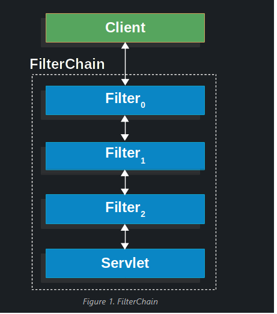
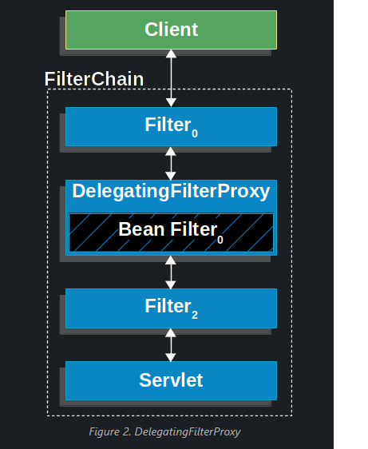
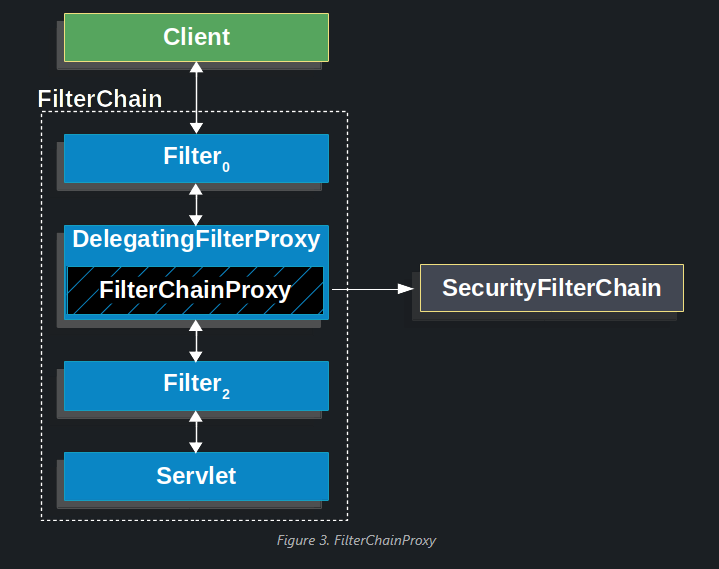
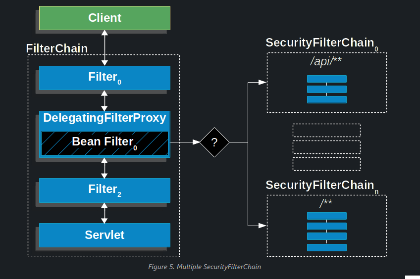
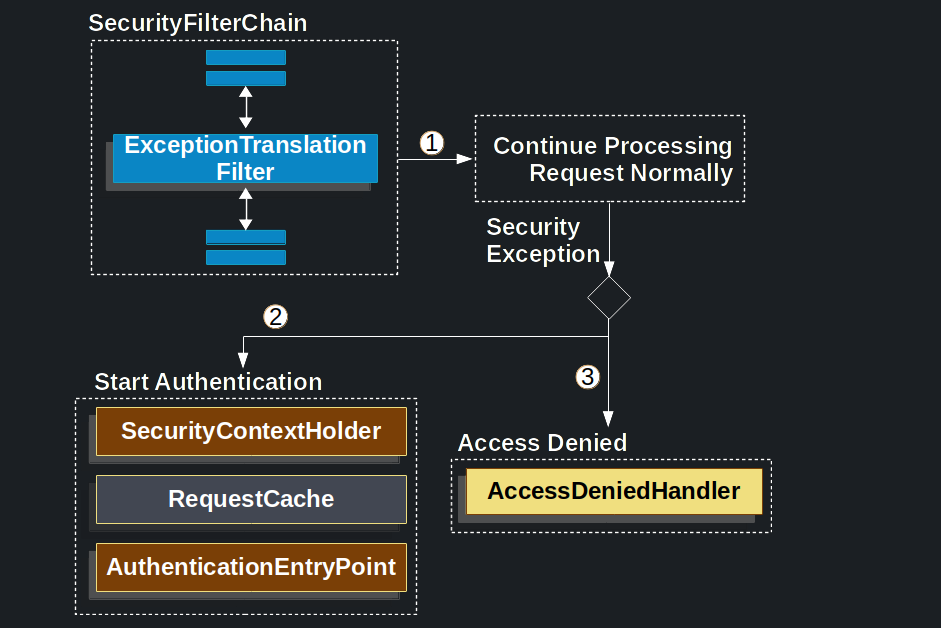
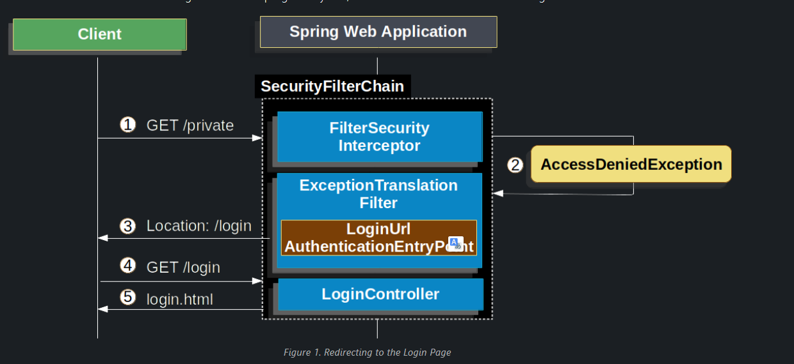
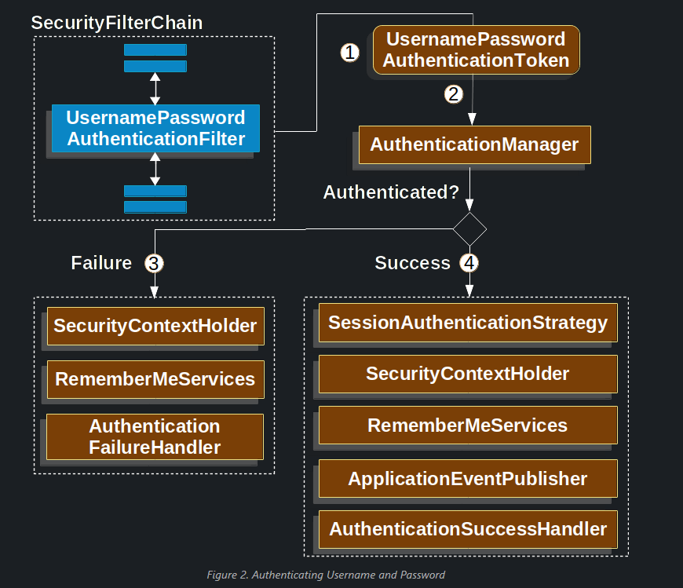
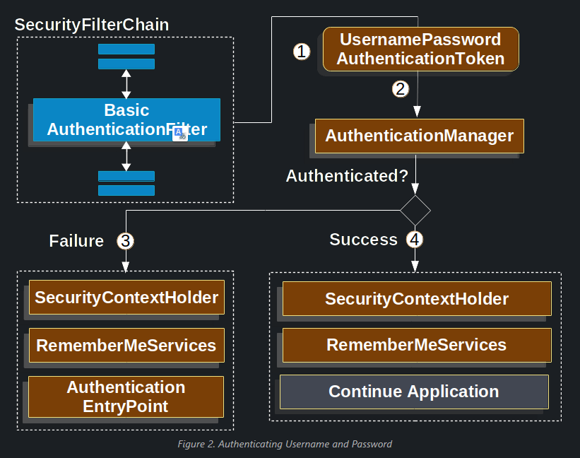

# Spring Security & Spring Boot in Servlet Applications

### Spring Boot Auto Configuration
**Spring Boot automatically**
- Ennables Spring Security's default configuration - creates `Filter` servlet as bean named `springSecurityFilterChain` - this bean for all the security URLs, validating submmitted username and passewords, redirecting to login form and so on.
- Creates `UserDetailsService` bean with a username of user and a randomly generated password.
- Registers the `Filter` with a bean named `springSecurityFilterChain`

**A summary of the features follows**:
- Require an thenticate user for any interaction with the application
- generate a defalt login form for you
- let the user with a username of user and password that is logged to console to authenticate with form-based authentication 
- Protects the password storage with BCrypt
- Lets the user log out
- CSRF attack prevention
- Session Fixation protection
- Security Header integration
- Integrate with the following Servlet API methods:
  + HttpServletRequest#getRemoteUser()
  + HttpServletRequest.html#getUserPrincipal()
  + HttpServletRequest.html#isUserInRole(java.lang.String)
  + HttpServletRequest.html#login(java.lang.String, java.lang.String)
  + HttpServletRequest.html#logout()

Will go to detail in source code

### Architecture
**Filters**

```java
public void doFilter(ServletRequest request, ServletResponse response, FilterChain chain) {
	// do something before the rest of the application
    chain.doFilter(request, response); // invoke the rest of the application
    // do something after the rest of the application
}
```
**DelegatingFilterProxy - Bridging Servlet and Spring application text** 
Filter implementation named `DelegatingFilterProxy`- bridging bw Servlet container’s lifecycle and Spring’s `ApplicationContext`. Servlet container allows registering `Filter` but not aware of Spring-defined Beans

```java
public void doFilter(ServletRequest request, ServletResponse response, FilterChain chain) {
	// Lazily get Filter that was registered as a Spring Bean
	// For the example in DelegatingFilterProxy delegate is an instance of Bean Filter0
	Filter delegate = getFilterBean(someBeanName);
	// delegate work to the Spring Bean
	delegate.doFilter(request, response);
}
```
**FilterChainProxy**
Spring security allows delegating to many `Filter` instance through `SecurityFilterChain`, Since `FilterChainProxy` is Bean, It wrapped in `DelegatingFilterProxy`


**SecurityFilterChain**
`SecurityFilterChain` is used by `FilterChainProxy` to dertermine which Spring Security Filter instance should be invoked for current request.


**Security Filters**
The Security Filters are inserted into the `FilterChainProxy` with `SecurityFilterChain` API.
Comprehensive list if Spring Security Filter ordering
ForceEagerSessionCreationFilter

ChannelProcessingFilter

WebAsyncManagerIntegrationFilter

SecurityContextPersistenceFilter

HeaderWriterFilter

CorsFilter

CsrfFilter

LogoutFilter

OAuth2AuthorizationRequestRedirectFilter

Saml2WebSsoAuthenticationRequestFilter

X509AuthenticationFilter

AbstractPreAuthenticatedProcessingFilter

CasAuthenticationFilter

OAuth2LoginAuthenticationFilter

Saml2WebSsoAuthenticationFilter

UsernamePasswordAuthenticationFilter

DefaultLoginPageGeneratingFilter

DefaultLogoutPageGeneratingFilter

ConcurrentSessionFilter

DigestAuthenticationFilter

BearerTokenAuthenticationFilter

BasicAuthenticationFilter

RequestCacheAwareFilter

SecurityContextHolderAwareRequestFilter

JaasApiIntegrationFilter

RememberMeAuthenticationFilter

AnonymousAuthenticationFilter

OAuth2AuthorizationCodeGrantFilter

SessionManagementFilter

ExceptionTranslationFilter

FilterSecurityInterceptor

SwitchUserFilter

**Hanldling Security Exceptions**
`ExceptionTranslationFilter` allows translation of `AccessDeniedException` and `AuthenticationException` into HTTP responses

The pseudocode for ExceptionTranslationFilter looks something like this:
```java
try {
	filterChain.doFilter(request, response); 
} catch (AccessDeniedException | AuthenticationException ex) {
	if (!authenticated || ex instanceof AuthenticationException) {
		startAuthentication(); 
	} else {
		accessDenied(); 
	}
}
```

**Saving Requests Between Authentication**
when a request has no authentication and is for a resource that requires authentication, there is a need to save the request for the authenticated resource to re-request after authentication is successful.
**RequestCache**
When the user successfully authenticates, the RequestCache is used to replay the original request
```java
@Bean
DefaultSecurityFilterChain springSecurity(HttpSecurity http) throws Exception {
	HttpSessionRequestCache requestCache = new HttpSessionRequestCache();
	requestCache.setMatchingRequestParameterName("continue");
	http.requestCache((cache) -> cache
			.requestCache(requestCache)
		);
	return http.build();
}
```
**Prevent the Request From Being Saved**
There are a number of reasons you may want to not store the user’s unauthenticated request in the session, or offload store in user's browser or store it in db or shut off feature (request)
```java
@Bean
SecurityFilterChain springSecurity(HttpSecurity http) throws Exception {
    RequestCache nullRequestCache = new NullRequestCache();
    http
        // ...
        .requestCache((cache) -> cache
            .requestCache(nullRequestCache)
        );
    return http.build();
}
```
**RequestCacheAwareFilter**
The RequestCacheAwareFilter uses the RequestCache to save the HttpServletRequest.

## Authentication
SpringS provides comprehensive support for `Authentication` for Servlet Application

### Servlet Authentication Architecture
- `SecurityContextHolder` - where Spring Security stores the details of who is authenticated.`
- `SecurityContext` - is obtained from `SecurityContextHolder` and contains the `Authentication` of currently aiuthenticated user.
- `Authentication`- Can be the input to AuthenticationManager to provide the credentials a user has provided to authenticate or the current user from the SecurityContext.
- `GrantedAuthority` granted to the principal on the Authentication (i.e. roles, scopes, etc.)
- `AuthenticationManager` the API that defines how Spring Security’s Filters perform authentication.
- `ProviderManager ` the most common implementation of AuthenticationManager.
- `AuthenticationProvide` used by ProviderManager to perform a specific type of authentication.
- `Request Credentials with AuthenticationEntryPoint`  used for requesting credentials from a client 
- `AbstractAuthenticationProcessingFilter` a base Filter used for authentication. This also gives a good idea of the high level flow of authentication and how pieces work together.

### Username and password Authentication
**When user is unauthenticate user**
1. User makes an unauthenticated request to resource.
2. `FilterSecurityInterceptor` indicates that the unautenticated request is *Denied* throwing `AccessDeniedException`
3. user not authenticated, `ExceptionTranslationFilter` initieates *Start Authentication* and send a redirect to login page with configured `AuthenticationEntryPoint` which is instance of `LoginUrlAuthenticationEntryPoint`
4. The browser was redirected/
5. Render the login page.


**When user login by login page**
1. User submits there username and password, `UsernamePasswordAuthenticationFilter ` create a `UsernamePasswordAuthenticationToken` which is a type of Authentication. Extracting the username and password from HttpServerletRequest instance.
2. UsernamePasswordAuthenticationToken is passed into the AuthenticationManager instance to be authenticated
3. If authentiaction fails.
   - The  `SecurityContextHolder` is cleanared out
   - RememberMeServices.loginFail is invoked
   - AuthenticationFailureHandler is invoked.
4. If authentication is successfull, then Success
   - `SessionAuthenticationStrategy` is notified of new login
   - The `Authentication` is set on the `SecurityContextHolder`
   - `RememberMeServices.loginSuccess` is invoked
   - `ApplicationEventPublisher` publishs an `InteractiveAuthenticationSuccessEvent`
   - `AuthenticationSuccessHandler` is invoked


**From HTML login**
- Perform `post` to login
- Need `CSRF Token` - automatically included by Thymeleaf
- specific the username in parameter named `username` and password in parameter named `password`
- HTTP parameter named `error` is found, it indicates the user failed to provide a valid username and password
- `logout` is found, it indicates the user logout successfully.

### Basic Authentication
1. User make an unauthenticated request to resource `/private`
2. Spring Security’s `FilterSecurityInterceptor` indicates that the unauthenticated request is Denied by throwing an AccessDeniedException.
3. `ExceptionTranslationFilter` initiates *Start Authentication*, `AuthenticationEntryPoint` sends a `WWW-Authenticate` header, the request cache is typically a `NullRequestCache` that doesn't save the request.


When a client receives the `WWW-Authenticate` header, it know should retry with a username and password.


### Digest Authentication
 Spring Security provides support for Digest Authentication, which provides `DigestAuthenticationFilter`

 Digest Authentication tries to solve many of the weaknesses of `Basic authentication`, never send the creadentials are never sent in clear text across the wire.
 HTTP Digest Authentication is defined by https://www.rfc-editor.org/rfc/rfc2617
SpringS support is compatible with "auth" quality of protection
```java
@Autowired
UserDetailsService userDetailsService;

DigestAuthenticationEntryPoint entryPoint() {
	DigestAuthenticationEntryPoint result = new DigestAuthenticationEntryPoint();
	result.setRealmName("My App Realm");
	result.setKey("3028472b-da34-4501-bfd8-a355c42bdf92");
}

DigestAuthenticationFilter digestAuthenticationFilter() {
	DigestAuthenticationFilter result = new DigestAuthenticationFilter();
	result.setUserDetailsService(userDetailsService);
	result.setAuthenticationEntryPoint(entryPoint());
}

@Bean
public SecurityFilterChain filterChain(HttpSecurity http) throws Exception {
	http.exceptionHandling(e -> e.authenticationEntryPoint(authenticationEntryPoint()))
		.addFilterBefore(digestFilter());
	return http.build();
}
```
## Password Storage
- Simple Storage with In-Memory Authentication
- Relationl Database with JDBC Authentication
- Custom data stores with UserDetailsService
- LDAP storage with LDAP Authentication

### In-Memory Authentication
`InMemoryUserDetailsManager` implements `UserDetailsService` to provide for username/password based authentication that is stored in memory, `InMemoryUserDetailsManager` implement `UserDetailManager` interface.
```java
@Bean
public UserDetailsService users() {
	UserDetails user = User.builder()
		.username("user")
		.password("{bcrypt}$2a$10$GRLdNijSQMUvl/au9ofL.eDwmoohzzS7.rmNSJZ.0FxO/BTk76klW")
		.roles("USER")
		.build();
	UserDetails admin = User.builder()
		.username("admin")
		.password("{bcrypt}$2a$10$GRLdNijSQMUvl/au9ofL.eDwmoohzzS7.rmNSJZ.0FxO/BTk76klW")
		.roles("USER", "ADMIN")
		.build();
	return new InMemoryUserDetailsManager(user, admin);
}
```
we use User.withDefaultPasswordEncoder to ensure that the password stored in memory is protected. However it is not protect the password by decompliling the source code. `User.withDefaultPasswordEncoder` should only used for getting started and is not intended for production. `UserBuilder users = User.withDefaultPasswordEncoder();`

### JdBC Authentication
`JdbcDaoImpl` implements `UserDetailsService` to provide support for username-and-password-based authentication that is retrieved by using JDBC, `JdbcUserDetailsManager` extends `JdbcDaoImpl` to provide management of `UserDetails` through the `UserDetailsManager` interface.

#### User schema
`JdbcDaoImpl` requires tables to load the password, account status (enabled or disabled) and a list of authorities (roles) for the user.

Default schema:org/springframework/security/core/userdetails/jdbc/users.ddl
```sql
create table users(
	username varchar_ignorecase(50) not null primary key,
	password varchar_ignorecase(500) not null,
	enabled boolean not null
);

create table authorities (
	username varchar_ignorecase(50) not null,
	authority varchar_ignorecase(50) not null,
	constraint fk_authorities_users foreign key(username) references users(username)
);
create unique index ix_auth_username on authorities (username,authority);
```
if your applciation uses group, you need to provide the group schema
```sql
create table groups (
	id bigint generated by default as identity(start with 0) primary key,
	group_name varchar_ignorecase(50) not null
);

create table group_authorities (
	group_id bigint not null,
	authority varchar(50) not null,
	constraint fk_group_authorities_group foreign key(group_id) references groups(id)
);

create table group_members (
	id bigint generated by default as identity(start with 0) primary key,
	username varchar(50) not null,
	group_id bigint not null,
	constraint fk_group_members_group foreign key(group_id) references groups(id)
);
```
Before use `JdbcUserDetailsManager`, must create a `DataSource`
```java
@Bean
DataSource dataSource() {
	return new EmbeddedDatabaseBuilder()
		.setType(H2) //for local is H2, for production uses external db
		.addScript(JdbcDaoImpl.DEFAULT_USER_SCHEMA_DDL_LOCATION)
		.build();
}
```

#### JdbcUserDetailsManager Bean
```java
@Bean
UserDetailsManager users(DataSource dataSource) {
	UserDetails user = User.builder()
		.username("user")
		.password("{bcrypt}$2a$10$GRLdNijSQMUvl/au9ofL.eDwmoohzzS7.rmNSJZ.0FxO/BTk76klW")
		.roles("USER")
		.build();
	UserDetails admin = User.builder()
		.username("admin")
		.password("{bcrypt}$2a$10$GRLdNijSQMUvl/au9ofL.eDwmoohzzS7.rmNSJZ.0FxO/BTk76klW")
		.roles("USER", "ADMIN")
		.build();
	JdbcUserDetailsManager users = new JdbcUserDetailsManager(dataSource);
	users.createUser(user);
	users.createUser(admin);
	return users;
}
```

## UserDetails
Returned by `UserDetailsService`. The `DaoAuthenticaltionProvider` validates the `UserDetails` then return an `Authentication` that has a principal that is the `UserDetails` 

## UserDetailsService
It's used by `DaoAuthenticationProvider` to retrive a username and password and other attributes for authenticating with a username and password. Spring Security provides in-memory and JDBC implemenations of `UserDetailsService`

## PasswordEncoder
Storing password securely byt integrating with `PasswordEncoder`. Can customize implemtation used by Spring Security.

## Dao AuthenticationProvider
It use UserDetailService and PasswordEncoder to authenticate a username and password.

## Full follow - todo: updating...

# LDAP Authentication
LDAP (Lightweight Directory Access Protocol) is often used by organizations as central repository. Used for store user information - role information for application users.

It doesn't use `UserDetailService` because in `bind authentication`, LDAP server doesn't return the psasword, so the application can't perform valication of the password.

SpringS uses separate strategy interfaces for authentication and role retrieval and provides default implementations

## Presrequisites
SHould familar with LDAP before trying to use it with SpringS - https://www.zytrax.com/books/ldap/
When use LDAP authentication, you should ensure that you properly configure LDAP connection pooling https://docs.oracle.com/javase/jndi/tutorial/ldap/connect/config.html

## Setting up an Embedded LDAP Server
Ensure you have an LDAP Server.
- Embedded UnboundID Server
- Embedded ApacheDS Server

We expose `users.ldif` as classpath resource to initialize the embedded LDAP server with two user, `user` and `admin`, both of which have a password of password
```
dn: ou=groups,dc=springframework,dc=org
objectclass: top
objectclass: organizationalUnit
ou: groups

dn: ou=people,dc=springframework,dc=org
objectclass: top
objectclass: organizationalUnit
ou: people

dn: uid=admin,ou=people,dc=springframework,dc=org
objectclass: top
objectclass: person
objectclass: organizationalPerson
objectclass: inetOrgPerson
cn: Rod Johnson
sn: Johnson
uid: admin
userPassword: password

dn: uid=user,ou=people,dc=springframework,dc=org
objectclass: top
objectclass: person
objectclass: organizationalPerson
objectclass: inetOrgPerson
cn: Dianne Emu
sn: Emu
uid: user
userPassword: password

dn: cn=user,ou=groups,dc=springframework,dc=org
objectclass: top
objectclass: groupOfNames
cn: user
uniqueMember: uid=admin,ou=people,dc=springframework,dc=org
uniqueMember: uid=user,ou=people,dc=springframework,dc=org

dn: cn=admin,ou=groups,dc=springframework,dc=org
objectclass: top
objectclass: groupOfNames
cn: admin
uniqueMember: uid=admin,ou=people,dc=springframework,dc=org
```

## Embedded UnboundID Server
```xml
<dependency>
	<groupId>com.unboundid</groupId>
	<artifactId>unboundid-ldapsdk</artifactId>
	<version>6.0.7</version>
	<scope>runtime</scope>
</dependency>
```
Can config by use `EmbeddedLdapServerContextSourceFactoryBean`, SpringS start an in-memory LDAP server.
```java
@Bean
public EmbeddedLdapServerContextSourceFactoryBean contextSourceFactoryBean() {
	return EmbeddedLdapServerContextSourceFactoryBean.fromEmbeddedLdapServer();
}
```

## Embedded ApacheDS Server
*Spring Security uses ApacheDS 1.x, which is no longer maintained. Unfortunately, ApacheDS 2.x has only released milestone versions with no stable release. Once a stable release of ApacheDS 2.x is available, we will consider updating.*

```xml
<dependency>
	<groupId>org.apache.directory.server</groupId>
	<artifactId>apacheds-core</artifactId>
	<version>1.5.5</version>
	<scope>runtime</scope>
</dependency>
<dependency>
	<groupId>org.apache.directory.server</groupId>
	<artifactId>apacheds-server-jndi</artifactId>
	<version>1.5.5</version>
	<scope>runtime</scope>
</dependency>
```
```java
@Bean
ApacheDSContainer ldapContainer() {
	return new ApacheDSContainer("dc=springframework,dc=org",
				"classpath:users.ldif");
}
```
## LDAP ContextSource
configure Spring Security to point to an LDAP server that should be used to authenticate users
```java
@Bean
public EmbeddedLdapServerContextSourceFactoryBean contextSourceFactoryBean() {
	EmbeddedLdapServerContextSourceFactoryBean contextSourceFactoryBean =
			EmbeddedLdapServerContextSourceFactoryBean.fromEmbeddedLdapServer();
	contextSourceFactoryBean.setPort(0);
	return contextSourceFactoryBean;
}
```

### Authentication
Spring Security’s LDAP support does not use the UserDetailsService because LDAP bind authentication does not let clients read the password or even a hashed version of the password (no way to read)

binding as the user, it may be necessary to read the attributes with the user’s own permissions.
`LdapAuthenticator` implementations:
- Using Bind Authentication
- Using Password Authentication

#### Using Bind Authentication
he user’s credentials (username and password) are submitted to the LDAP server, which authenticates them
```java
@Bean
AuthenticationManager authenticationManager(BaseLdapPathContextSource contextSource) {
	LdapBindAuthenticationManagerFactory factory = new LdapBindAuthenticationManagerFactory(contextSource);
	factory.setUserDnPatterns("uid={0},ou=people");
	return factory.createAuthenticationManager();
}
```

## Using Password Authentication
Password comparison is when password supplied by the user is compared with on stored in the repository, this can either be done by get value of the pssword attribute and checking it locally or performing an LDAP "compare" peration, LDAP compare can't be dome when the pssword is hashed with a random salt
```java
AuthenticationManager authenticationManager(BaseLdapPathContextSource contextSource) {
	LdapPasswordComparisonAuthenticationManagerFactory factory = new LdapPasswordComparisonAuthenticationManagerFactory(
			contextSource, NoOpPasswordEncoder.getInstance());
	factory.setUserDnPatterns("uid={0},ou=people");
	return factory.createAuthenticationManager();
}
```
## LdapAuthoritiesPopulator
Eo hieu phai thuc hanh ms nho dc